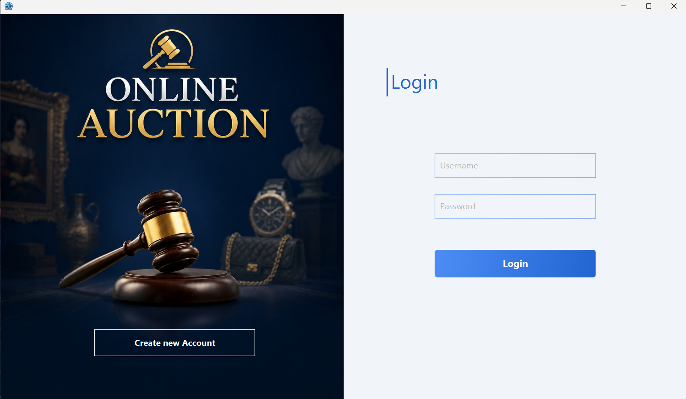
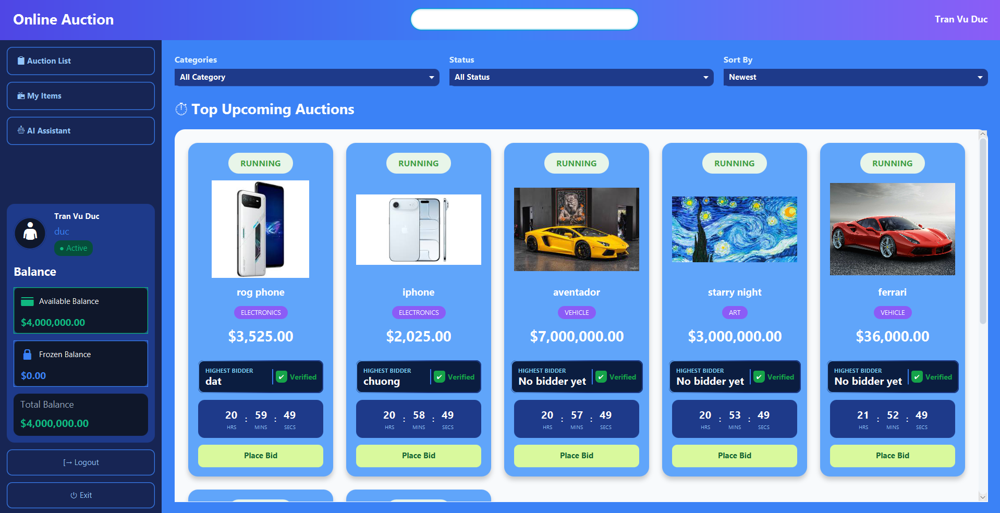
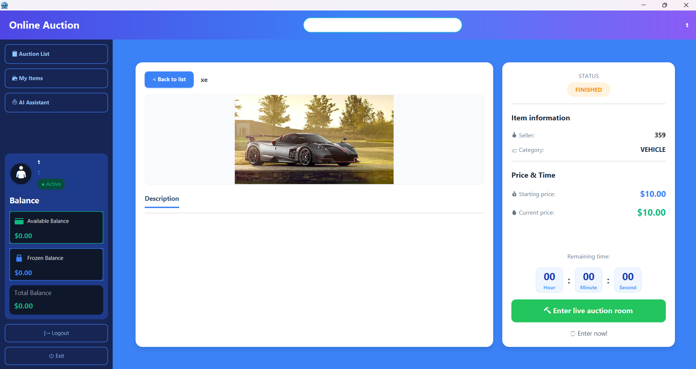
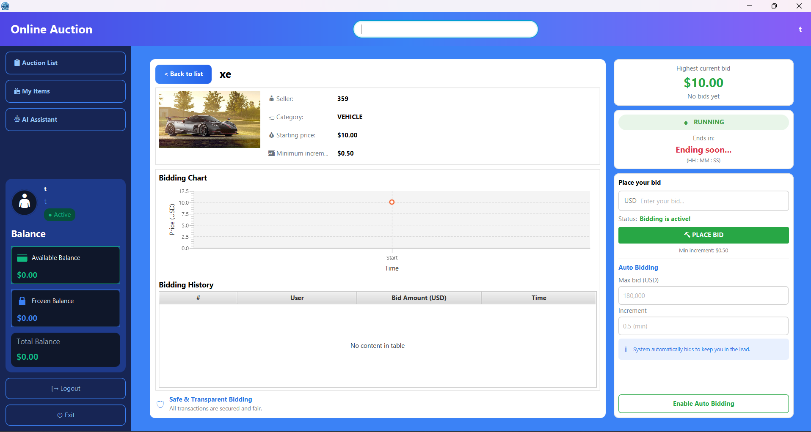
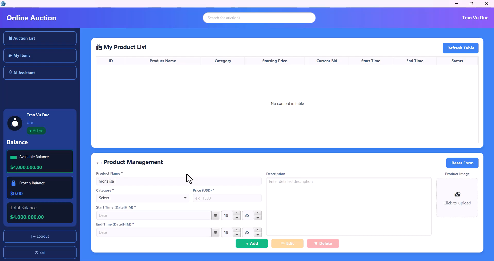
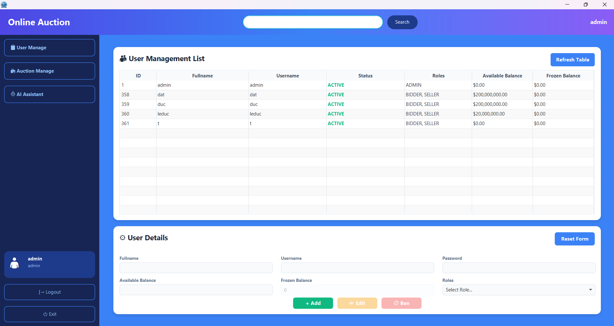
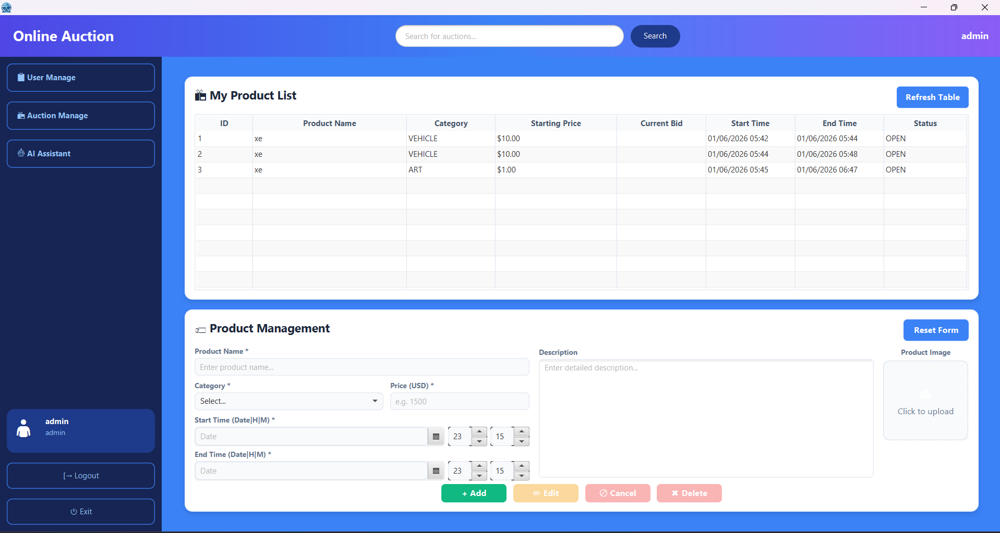
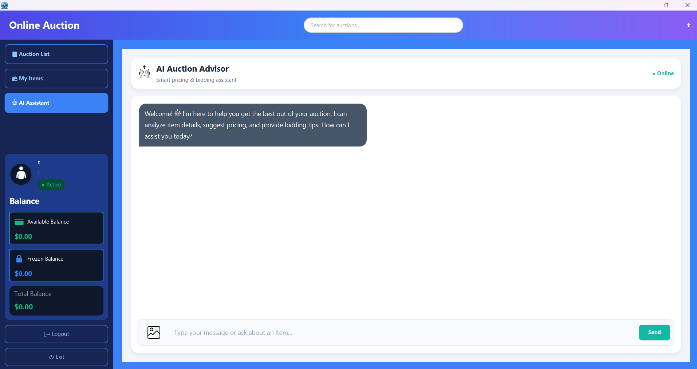

# 🔨 Online Auction System: Real-Time Online Auction System (Group 7 K70I-IT4 UET-VNU)

Welcome to the **BidMaster** repository. This project is a robust, multi-module Client-Server desktop application designed to modernize the online auction experience.

## 📖 1. Project Overview

### Problem Statement
Traditional online auction platforms often suffer from delayed synchronization and lack intuitive, intelligent tools to assist users during fast-paced bidding. There is a critical need for a responsive, real-time application that not only handles concurrent bids securely but also leverages advanced AI vision capabilities to automate and enhance item analysis for users.

### System Scope
This project is built on **Java 25** and designed exclusively as a high-performance desktop application. It features a rich **JavaFX-based GUI**, robust data security utilizing **Bcrypt** password hashing, and persistent cloud storage via **AWS RDS (MySQL)**. A defining feature of the system is the integration of the **Qwen 3VL 8B** Vision-Language AI model (powered by LangChain4j and Ollama) to provide users with advanced, multimodal AI assistance.

---

## ✨ 2. Key Features

### 🔐 Authentication & Security

* **User Login & Registration:** Secure authentication flows protected by Spring Security's Bcrypt hashing.
* **Session Management:** Reliable and secure user state maintenance across the application lifecycle.

### 🏷️ General User & Bidder Tools

* **Main Dashboard:** A responsive, interactive central hub (`MainAuctionController`).


* **Live Auction Listing:** Real-time visibility of active and upcoming auctions (`ListViewportController`, `ItemCardController`).
* **Detailed Item View:** In-depth inspection of specifications and current bidding status (`DetailViewportController`).


* **Real-time Bidding:** Instant bid synchronization powered by low-latency Socket networking (`BidViewportController`).

### 📦 Seller Hub

* **Auction Creation:** Seamless interface to upload item details, configure starting prices, and define auction durations (`SellerViewportController`).
* **Inventory Management:** A dedicated space for sellers to track and manage their listed assets.

### 🛡️ Admin Management Panel
* **Centralized Dashboard:** A comprehensive control hub for administrators (`AdminMainAuctionController`).


* **User Management:** Tools to view, edit, ban, or resolve user account issues (`AdminUserManageController`).


* **Auction Monitoring:** Oversight of ongoing auctions with the ability to resolve disputes or forcefully terminate violating listings (`AdminAuctionManageController`).

### 🤖 Advanced AI Integration

* **Multimodal AI Assistant:** Context-aware assistance utilizing the **Qwen 3VL 8B** model (via LangChain4j) to analyze items, answer complex user queries, and provide intelligent bidding insights (`AIViewportController`).

---

## 🛠️ 3. Technologies & Infrastructure

| Category | Technologies Used |
| :--- | :--- |
| **Core & App** | Java 25, Maven, JavaFX 25, ControlsFX, Gson |
| **Database & Security** | AWS RDS (MySQL 8.2.0), Spring Security Crypto (Bcrypt) |
| **AI Integration** | LangChain4j, Qwen 3VL 8B, Ollama |
| **Cloud & DevOps** | AWS EC2 (VPS), Ngrok, GitHub Actions (CI/CD), Docker, JUnit 5 |

---

## 📂 4. Project Structure

This system utilizes a Maven multi-module architecture to cleanly separate concerns and maximize scalability.

```text
Group-7-Project-Online-Auction-System/
├── .github/                  # CI/CD pipelines (GitHub Actions workflows)
├── client/                   # Frontend Module (Desktop App)
│   ├── src/                  # JavaFX UI, Controllers, and Client Networking
│   └── pom.xml               # Client dependencies (JavaFX, ControlsFX)
├── server/                   # Backend Module (Server & DB Logic)
│   ├── src/                  # Socket logic, DB operations, AI Integration
│   ├── data/                 # Server local data/configs (if any)
│   └── pom.xml               # Server dependencies (MySQL, BCrypt, LangChain4j)
├── common/                   # Shared Library Module
│   ├── src/                  # Shared Models, Entities, and Utility classes
│   └── pom.xml               # Common dependencies (Gson)
├── Dockerfile                # Docker configuration for deployment
└── pom.xml                   # Root/Parent Maven configuration
```

## 🚀 5. Getting Started

### Prerequisites
* **Java Development Kit (JDK) 25** installed and configured on your system.
* **Maven** installed (if you plan to use global Maven commands instead of the included Maven Wrapper).

### ⚠️ Execution Order
Because this is a Client-Server architecture, you **must** start the Server module first before launching the Client.

### Running the Application (Global Maven)
If you have Maven installed globally, open your terminal/command prompt at the root directory of the project and execute:

1. **Start the Server:**

```bash
mvn clean compile exec:java -pl server
```

2. **Start the Client** *(Open a new terminal window)*:

```bash
mvn clean compile exec:java -pl client
```

### Running the Application (Maven Wrapper - mvnw)
If you prefer not to install Maven globally, you can use the built-in Maven Wrapper.

#### 🪟 Windows (CMD / PowerShell)
*Note: Windows uses backslashes (`\`) for directory paths.*

1. **Start the Server:**

```cmd
# In Command Prompt (CMD)
mvnw.cmd clean compile exec:java -pl server

# In PowerShell
.\mvnw.cmd clean compile exec:java -pl server
```

2. **Start the Client:**

```cmd
# In Command Prompt (CMD)
mvnw.cmd clean compile exec:java -pl client

# In PowerShell
.\mvnw.cmd clean compile exec:java -pl client
```

#### 🍎 macOS / 🐧 Linux (Ubuntu)
*Note: macOS and Linux use forward slashes (`/`) for directory paths.*

1. **Start the Server:**

```bash
./mvnw clean compile exec:java -pl server
```

2. **Start the Client:**

```bash
./mvnw clean compile exec:java -pl client
```

---

## 📊 6. Project Materials & Demonstration

* **Project Report (PDF):**
  📄 👉 [CLICK HERE TO VIEW OR DOWNLOAD THE PDF REPORT](assets/BaoCao_BAITAPLON.pdf) 👈

* **Video Demo:**
  🎥 👉 [CLICK HERE TO WATCH THE DEMO VIDEO](https://www.youtube.com/watch?v=51rDGqMxa3A&t=23s) 👈